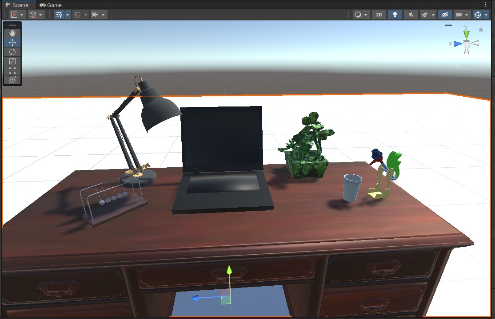

# computer-graphics-project
Equipo:
Sofia Vega Zambada			A01114487
Sebastian Aguirre Alfaro	A01039753
José Elías Garza Vázquez	A00824494

Descripción del proyecto:

En la escena ve un escritorio con los siguientes elementos:

1. Drinking bird:  Juguete de escritorio que tiene la forma de un pájaro tomando agua de un vaso.
2. Un escritorio: Un escritorio con los demás elementos encima.
3. Newton´s Cradle
4. Laptop antigua: Una computadora con una imagen de windows 95 en la pantalla.
5. Lámpara: Una lámpara de escritorio que el usuario puede prender y apagar.
6. Planta: Una planta en maceta.
7. Un vaso: Un vaso de vidrio con agua.

La escena luce así actualmente:

Todos los modelos usados fueron creados por diseñadores 3D externos al proyecto, a continuación se hace referencia a la autoría de cada modelo:

- "Drinking_Bird_Asset" (https://skfb.ly/6ZDXn) by ZachWilkins1997 is licensed under Creative Commons Attribution (http://creativecommons.org/licenses/by/4.0/).
- "Antique wooden desk" (https://skfb.ly/orwYM) by Lorenzo Drago is licensed under Creative Commons Attribution (http://creativecommons.org/licenses/by/4.0/).
- "newtons cradle" (https://www.turbosquid.com/3d-models/free-newtons-cradle-3d-model/844906) by BlueDolphinAnimation is licensed under Creative Commons Attribution (http://creativecommons.org/licenses/by/4.0/).
- "Low poly Old Notebook" (https://www.turbosquid.com/3d-models/free-old-notebook-3d-model/575955) by janiashvili is licensed under Standard 3D Model License (https://blog.turbosquid.com/turbosquid-3d-model-license/).
- "Desk lamp bronze(1) 3D" (https://www.turbosquid.com/3d-models/desk-lamp-3d-1281231) by Aliciapansardi is licensed under Standard 3D Model License (https://blog.turbosquid.com/turbosquid-3d-model-license/).
- "Broad Leaf Succulent Concrete Pot Plant model" (https://www.turbosquid.com/3d-models/leaf-succulent-concrete-pot-plant-model-1696677) by SPACESCAN is licensed under Standard 3D Model License (https://blog.turbosquid.com/turbosquid-3d-model-license/).
- "Legendary Soviet Table-Glass" (https://www.turbosquid.com/3d-models/free-legendary-soviet-table-glass-3d-model/825305) by DrewRMT is licensed under Standard 3D Model License (https://blog.turbosquid.com/turbosquid-3d-model-license/).

Every model imported here is for Educational Uses. 
